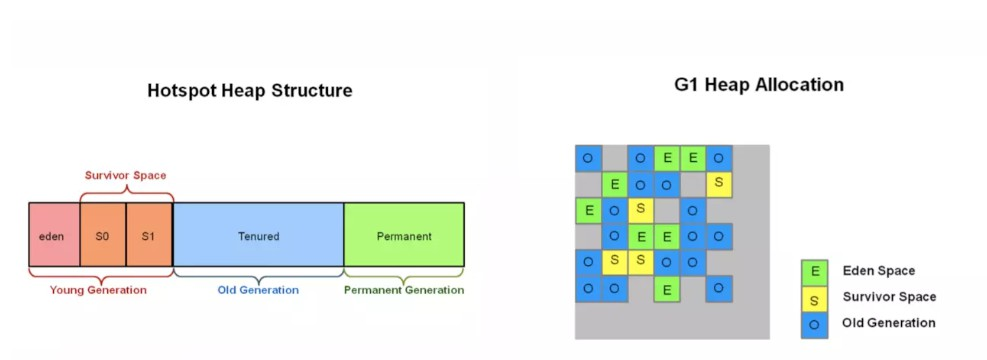
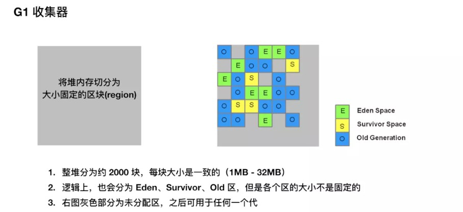

## G1 垃圾收集器介绍
***
#### G1 总览
首先在内存划分上，G1垃圾收集器依然是基于分代收集的。不同的是G1收集器将整个堆划分为一个个大小相同的区块（Region），每一块的内存是连续。和分代收集算法一样，G1中每个块回充当Eden、Survivor、Eden三种角色。不同的是他们是固定的，这使得内存使用非常灵活。

执行垃圾收集时，和 CMS 一样，G1 收集线程在标记阶段和应用程序线程并发执行，标记结束后，G1 也就知道哪些区块基本上是垃圾，存活对象极少，G1 会先从这些区块下手，因为从这些区块能很快释放得到很大的可用空间，这也是为什么 G1 被取名为 Garbage-First 的原因。

#### G1收集器收集器的收集活动主要包括四种
- 新生代垃圾收集
- 后台收集，并发周期
- 混合式垃圾收集
- 以及必要时Full GC

G1收集器的堆结构

G1收集器的并发周期包括多个阶段，其中的一些会占用所有应用线程

#### Old GC / 并发标记周期
接下来是 Old GC 的流程（含 Young GC 阶段），其实把 Old GC 理解为并发周期是比较合理的，不要单纯地认为是清理老年代的区块，因为这一步和年轻代收集也是相关的。下面我们介绍主要流程：

>初始标记(initial-mark)：stop-the-world，它伴随着一次普通的 Young GC 发生，然后对 Survivor 区（root region）进行标记，因为该区可能存在对老年代的引用。

因为 Young GC 是需要 stop-the-world 的，所以并发周期直接重用这个阶段，虽然会增加 CPU 开销，但是停顿时间只是增加了一小部分。

>扫描根引用区：扫描 Survivor 到老年代的引用，该阶段必须在下一次 Young GC 发生前结束。

这个阶段不能发生年轻代收集，如果中途 Eden 区真的满了，也要等待这个阶段结束才能进行 Young GC。

>并发标记：寻找整个堆的存活对象，该阶段可以被 Young GC 中断。

这个阶段是并发执行的，中间可以发生多次 Young GC，Young GC 会中断标记过程

>重新标记：stop-the-world，完成最后的存活对象标记。使用了比 CMS 收集器更加高效的 snapshot-at-the-beginning (SATB) 算法。

Oracel 的资料显示，这个阶段会回收完全空闲的区块

>清理：清理阶段真正回收的内存很少。

到这里，G1 的一个并发周期就算结束了，其实就是主要完成了垃圾定位的工作，定位出了哪些分区是垃圾最多的。

####混合垃圾回收周期
并发周期结束后是混合垃圾回收周期，不仅进行年轻代垃圾收集，而且回收之前标记出来的老年代的垃圾最多的部分区块。

混合垃圾回收周期会持续进行，直到几乎所有的被标记出来的分区（垃圾占比大的分区）都得到回收，然后恢复到常规的年轻代垃圾收集，最终再次启动并发周期。

###FULL GC

下面我们来介绍特殊情况，那就是会导致 Full GC 的情况，也是我们需要极力避免的：

- concurrent mode failure：并发模式失败，CMS 收集器也有同样的概念。G1 启动标记周期，但在 Mix GC 之前，老年代就被填满，这时候 G1 会放弃标记周期。，Stop-The-World进行清理空间

>解决办法: 
>* 增加堆空间 
>* 调整并发周期，即增加后台运行线程数，让并发周期尽快结束。
>* 更早的进行并发周期，默认的是堆内存的45%被占用就进行并发周期 

- 晋升失败：并发周期结束后，是混合垃圾回收周期，伴随着年轻代垃圾收集，进行清理老年代空间，如果这个时候清理的速度小于消耗的速度，导致老年代不够用，那么会发生晋升失败    

>解决办法: 混合垃圾回收需要更迅速完成垃圾收集，也就是说在混合回收阶段，每次年轻代的收集应该处理更多的老年代已标记区块。 

- 疏散失败：年轻代垃圾收集的时候，如果 Survivor 和 Old 区没有足够的空间容纳所有的存活对象。这种情况肯定是非常致命的，因为基本上已经没有多少空间可以用了，这个时候会触发 Full GC 也是很合理的。
>解决办法：最简单的就是增加堆大小

- 大对象分配失败，我们应该尽可能地不创建大对象，尤其是大于一个区块大小的那种对象。

G1垃圾收集器主要调优目标就是避免并发模式失败和疏散失败，一旦发生这些失败，就会导致FULL GC，避免Full Gc就是G1垃圾收集器调优的首要任务。G1垃圾收集器调优的目标之一就是调优简单，G1收集器最主要的调优就是通过一个标志：-XX：MaxGCPauseMillis=N,使用G1收集器时，该标志的默认值为200，如果G1收集器发送停顿时间超过该值，G1垃圾收集器会尝试各种方法弥补--譬如调整新生代老年代比例、调整堆大小、更早的启动后台处理、概念晋升阈值、或者是在混合式垃圾收集周期中处理更多或者更少的老年代分区

参考文章： 
 
《Java性能权威指南》  
《深入理解Java虚拟机》  
[深入理解g1垃圾收集器](http://ifeve.com/%E6%B7%B1%E5%85%A5%E7%90%86%E8%A7%A3g1%E5%9E%83%E5%9C%BE%E6%94%B6%E9%9B%86%E5%99%A8/)  
[G1 垃圾收集器介绍](http://www.importnew.com/27793.html)  
[G1 垃圾收集器介绍](https://juejin.im/entry/5af0832c51882567244deb44)